:title:         How to train (and reprogram, actually) your quadcopter
:author:        Salamandar
:css:           ccc-nano-drone.css

.. include:: <isoamsa.txt>

----

How to train (and reprogram, actually) your Quadcopter !
========================================================
:id: first-slide

.. note::
    Salamandar
    talk about hardware reverse engineering
    a bit about hacking

----

About me
========

* Young Physics researcher \& C/C++ dev

* Discovered robotics 2½ years ago with STm32 and dsPIC

* First time hacking & reveng

* Very bad quadcopter pilot

.. note::
    i actually discovered reverse engineering on this drone

----

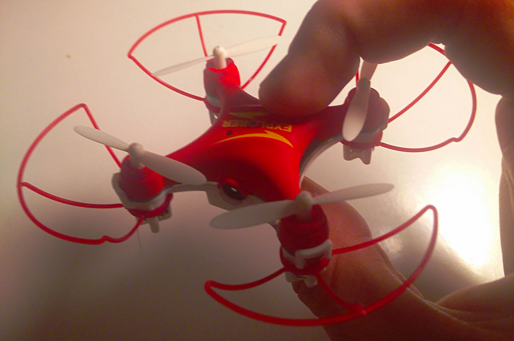

.. note::
    webcam on sd card

----

Goals
=====

* Reverse engineering

  + the electronics

  + the radio protocol

* Improve the quadcopter ?

    + Asservissement

    + Fun tweaks

    + Bluetooth control ?

* Learn about electronics

* Start a vulgarization blog

* Start a code base for other potential projects (drones, IOT)

* Have fun !

.. role:: small

:small:`Well, I only started some weeks ago !…`

----

Rev-engineering the electronics
===================================

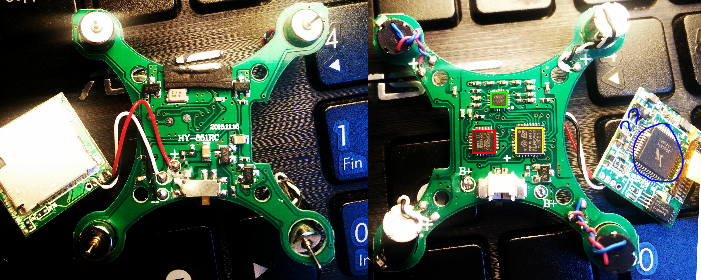

.. note::
    two pcbs, the first one is actually the structure of the drone, the second one
    handles the video part. one wire communication.

----

Let's find datasheets (1/3)
============================

* STm32F03 :

    * Cortex M0 @48MHz
    * I know that thing !
    * 16kB Flash + 4k SRAM : VERY low-end MCU
    * No FPU = no float, no sin/cos/tan…
    * Proprietary code read-out protection : not software rev-eng :(

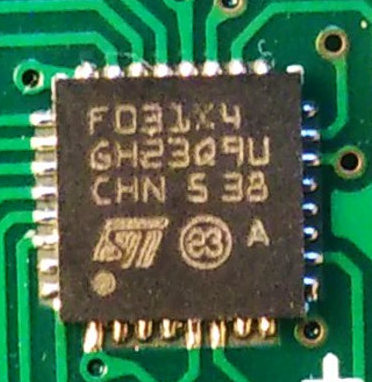

----

Let's find datasheets (2/3)
============================

* Invensense MPU-6052C :

    * 3-axis gyroscope and accelerometer
    * One "Preliminary and confidential" datasheet, not detailled enough
    * Almost like the MPU-6050, well-known MPU |srarr| good.
    * I2C communication

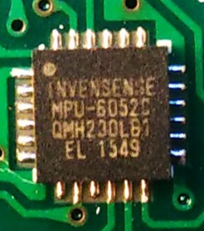

----

Let's find datasheets (3/3)
============================

* Panchip XN-297 :

    * 2.4GHz radio : possible bluetooth !
    * Clone of Beken BK2425, itself a Nordic nRF24L01+ clone…
    * …with extra registers : ``DEMOD_CAL, DYNPD, FEATURE, RF_CAL, BB_CAL`` uh ?
    * SPI communication

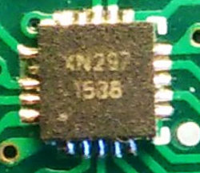

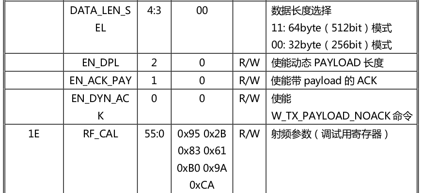

----

WTF is that chip ?
===================

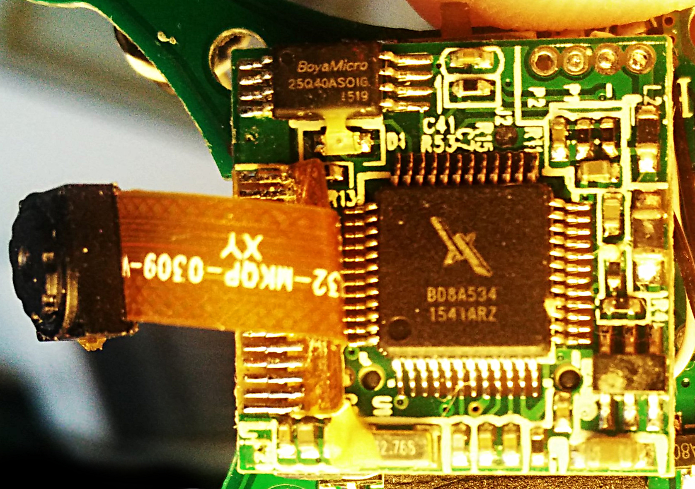

.. note::
    the internet does not know this reference or logo
    it probably is FPGA as its common for video processing
    but it's not a problem, I just have to understand the protocol to take pictures and videos

----

Rev-engineering the electronics
===================================

* Gimp + multiple layers for drawing tracks

* Kicad for the schematics

.. image:: ./images/electronics_gimp.png
    :align: center
    :width: 100%

.. note::
    took pictures of the two layers of the pcb
    noted the vias, tracks and chips pinouts
    used kicad, the open source pcb design software to redesign the pcb
    the big "plus"

----

Rev-engineering the electronics
===================================

* SWDI/O (Serial Wire Debug) is accessible

.. note::
    there is written "b+" for the two battery connectors
    the whole pcb has errors
    it's a quite easy pcb

----

Soldering + Epoxy
======================

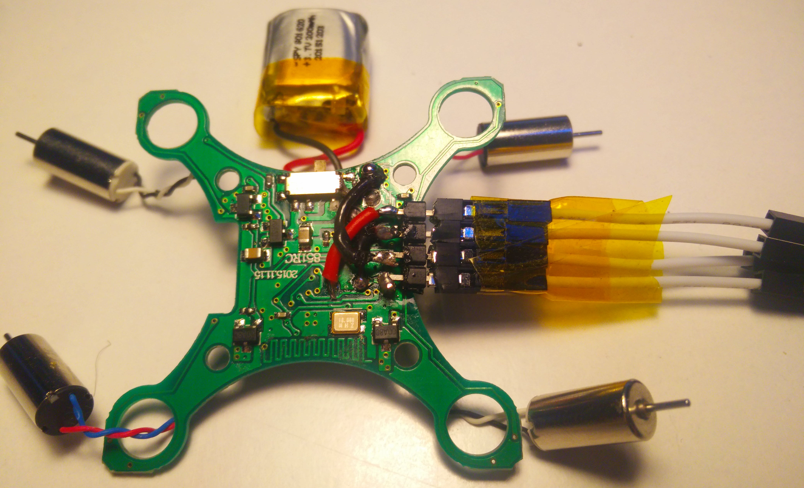

----

Thanks ST-Link on Nucleo ;)
=============================

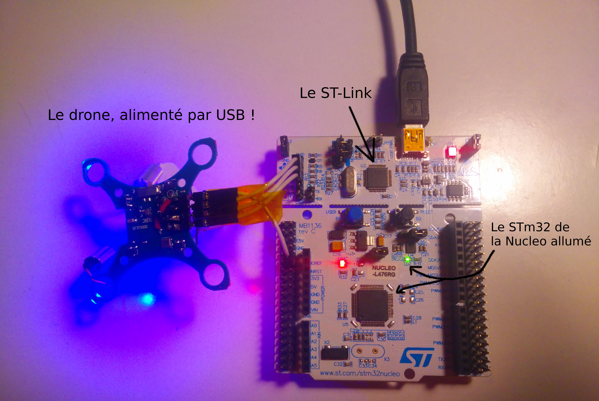

.. note::
    i posted this image on my french blog so sorry for the french.
    i just wanted to show you here the ST board I used, it is kinda like the
    board some people used to hack electronic locks, on the first day here.

----

Dumping the firmware for reverse engineering
=================================================

* Using OpenOCD

.. code:: bash

    $ sudo openocd -f /usr/share/openocd/scripts/board/st_nucleo_f0.cfg &
    $ telnet localhost 4444
    > init
    > flash probe 0
    Info : device id = 0x10006444
    device id = 0x10006444
    Info : flash size = 16kbytes
    flash size = 16kbytesflash 'stm32f1x' found at 0x08000000
    flash 'stm32f1x' found at 0x08000000
    > dump_image drone.bin 0x08000000 0x20000
    # Empty drone.bin
    > stm32f1x unlock 0
    # Now I can write to the flash !

* STm32 = Software read-out protection bits |srarr| no software retro-engineering ! 😞

    * I could have tried some voodoo things but… Meh.

----

Developping & Flashing the software
=======================================

Nothing fantastic :

* Arm-none-eabi toolchain + CMake

* LibOpenCM3 as Hardware Abstraction Layer

* OpenOCD for flashing

----

Debugging
===========

* No UART/serial output, so ideas :

    + Solder directly on the STm32 ``UART TX``

    + Use the LEDs as I/Os

* Remote GDB session : Yay !

    + Watch values

    + No easy value "streaming"

----

…

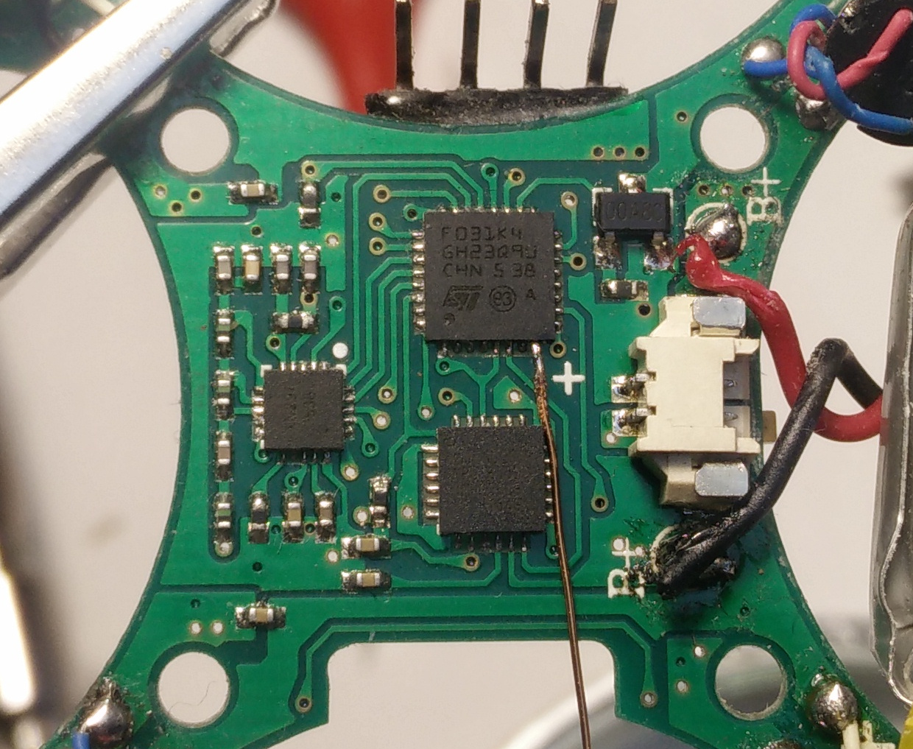

----

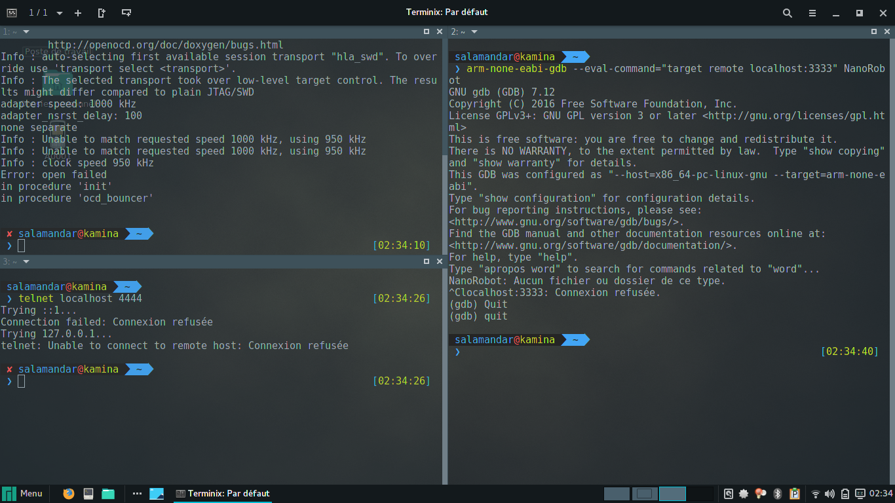

----

Reverse-engineering the radio
===============================

* 2.4GHz with a nRF24L01+ clone : XN-297

* SPI communication

* Arduino sniffer :

    * Commands : Radio channel/CRC/… configuration
    * Radio frames

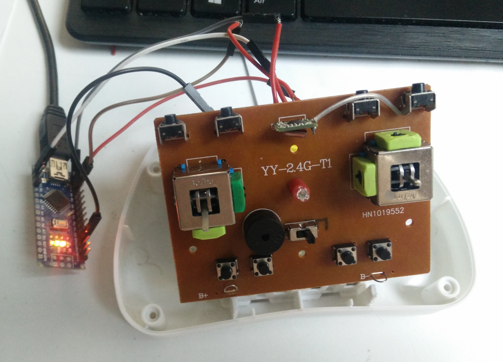

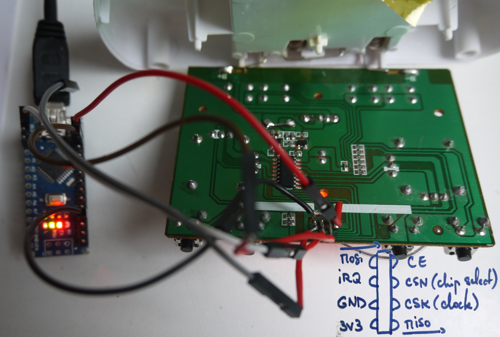

----

A whole radio frame :

::

    0x20 0x0e // Write byte config (Power up, CRC 1 byte enabled)
    0x25 0x48 // Write byte RF_channel (freq channel : 100 1000 = chann 72)
    0x27 0x70 // Write byte status (clear TX_status/RX_status/MAX_RT status bits)
    0xe1 0x00 // Flush TX (clean and new TX buffer)
    0xa0 0x55 0x3a 0x88 0x89 0x8a 0xdc 0x05 0xdc 0x05 0xe8 0x03 0xdc 0x05 0x00 0x00
    // Write TX buffer data

    // Data frame :
    //                   Roll  Pitch Thro  Yaw
    // A0 55 3A 88 89 8A rr 0r pp 0p tt 0t yy Xy XX X0
    // 01 02 03 04 05 06 07 08 09 10 11 12 13 14 15 16
    // byte 14 : 1000 .... Looping
    // byte 15 : .1.. .... (press repeat) calibration B (btn2)
    // byte 15 : ..1. .... (press repeat) calibration F (btn1)
    // byte 15 : ...1 .... (press repeat) calibration L (btn3)
    // byte 15 : .... 1... (press repeat) calibration R (btn4)
    // byte 15 : .... ..xx Difficulty (0, 1, 2)
    // byte 16 : .100 0000 (toggle button) photo
    // byte 16 : 1.00 0000 (toggle button) video

----

* Channel configuration :

    + Initially (appairing), channel 2

    + After remote appairing, channel changes to 27 to confuse hacker

    + Same channels (2 then 27) for every remote & drone

* Whole frame

    + Little endian 12 bits values Yaw/Pitch/Roll

    + Toggle bits for actions

* No drone feedback

----

Accelerometer + gyroscope (i2c)
=================================

* LibOpenCM3 is bugged :

    * The STm32 starts and sends an i2c request

    * The MPU didnt start yet

    * LibOpenCM3 is waiting for an acknowledgement… that never occurs

* I used the ST's HAL (ugh…)

    * Binary size 6KB |srarr| 10KB…
    * Cleaning : down to 7.4KB

.. note::
    some part of me wanted to see how bad the HAL is, and another part was just
    lazy

----

Emulated EEPROM
================

* Needs to save TRIM/settings

* The only possibility is to use a Flash block : 4KB

|srarr| 16KB Flash = 12KB ROM + 4KB data

----

What do I get ?
===============

* No FPU : no floats at all !

    * One float variable : binary size += 2KB

    * Sin/Cos/Tan : binary size >> 16KB

* 1.2ms control loop (most of the time is in SPI/i2c)

* Speed controlled LEDs

----

Let's make it fly… or not.
==============================

* PID controlled system

    * Without floats : meh.

    * Needs trimming

    * Needs per-motor correction

* Not the easiest/fastest part, and the least interesting

----

Having fun
==============

.. raw:: html

    <embed>
        <video controls preload="auto" height=600 width=auto
            src="./imperial_march.mp4" />
    </embed>

----

Is it legal ?
==============

* Hardware is open by default

    * Unless specified, you do what you want

    * Even modifying or re-flashing, seem legal

* Software is closed by default

    * Reverse-engineering legally forbidden

    * Dumping and modify the firmware is illegal

----

What's next ?
==============

* Finish the PID trimming

* Code base for other quadcopters / other hardwares / other HAL libraries

* Hack my robot vacuum (STm32f3)

* Hack my hexacopter (WTF is that chip ? Pt. 2) ``Chomp ZC-4J01``

----

Thank you !
============

Hacking is actually often easy

We have to hack the world !

* Blog & more details : ``geekolloc.fr``

* Code, datasheets,… : ``github.com/Salamandar/nano-drone``

