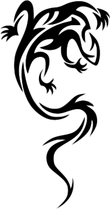

:title:         How to train (and reprogram, actually) your quadcopter
:author:        Salamandar
:css:           ccc-nano-drone.css

----

How to train (and reprogram, actually) your Quadcopter !
========================================================
:id: first-slide

----

About me
========

* (very) young Physics researcher \& C++ dev

* fee

* fii

* foo

----

Goals
=====

* Reverse engineering

  + the electronics

  + the radio protocol

* Improve the quadcopter ?

    + Asservissement

    + Fun tweaks

    + Bluetooth control ?

* Learn about electronics

* Start a code base for other potential projects (drones, IOT)

* Have fun !

----

Rev-engineering the electronics
===================================

----

First header
============

You can choose other punctuation characters as your level 1 heading if you like,
but this is the most common. Any if these character works::

    = - ` : ' " ~ ^ _ * + # < > .

Second header
-------------

Third header
............

The drawback with reStructuredText is that you can't skip levels. You can't
go directly from level 1 to level 3 without having a level 2 in between.
If you do you get an error::

    Title level inconsistent

Other formatting
================

All the normal reStructuredText functions are supported in Hovercraft!

- Such as bulletlists, which start with a dash (-) or an asterisk (*).
  You can have many lines of text in one bullet if you indent the
  following lines.

   - And you can have many levels of bullets.

       - Like this.

- There is *Emphasis* and **strong emphasis**, rendered as <em> and <strong>.

More formatting
===============

#. Numbered lists are of course also supported.

#. They are automatically numbered.

#. But only for single-level lists and single rows of text.

#. ``inline literals``, rendered as <tt> and usually shown with a monospace font, which is good for source code.

#. Hyperlinks, like Python_

.. _Python: http://www.python.org

Slides can have presenter notes!
================================

This is the killer-feature of Hovercraft! as very few other tools like this
support a presenter console. You add presenter notes in the slide like this:

.. note::

    And then you indent the text afterwards. You can have a lot of formatting
    in the presenter notes, like *emphasis* and **strong** emphasis.

    - Even bullet lists!

    - Which can be handy!

    But you can't have any headings.

Source code
===========

You can also have text that is mono spaced, for source code and similar.
There are several syntaxes for that. For code that is a part of a sentence
you use the inline syntax with ``double backticks`` we saw earlier.

If you want a whole block of preformatted text you can use double colons::

    And then you
    need to indent the block
    of text that
    should be preformatted

You can even have the double colons on a line by themselves:

::

    And this text will
    now be
    rendered as
    preformatted text

Syntax highlighting
===================

But the more interesting syntax for preformatted text is the .. code::
directive. This enables you to syntax highlight the code.

.. code:: python

    def day_of_year(month, day):
        return (month - 1) * 30 + day_of_month

    def day_of_week(day):
        return ((day - 1) % 10) + 1

    def weekno(month, day):
        return ((day_of_year(month, day) - 1) // 10) + 1

