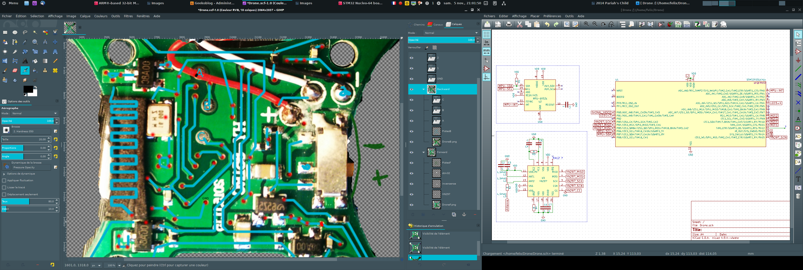

:title:         How to train (and reprogram, actually) your quadcopter
:author:        Salamandar
:css:           ccc-nano-drone.css

.. include:: <isoamsa.txt>

----

How to train (and reprogram, actually) your Quadcopter !
========================================================
:id: first-slide

----

About me
========
.. image:: ./images/Salamander.png
    :align: left
    :height: 210px

* Young Physics researcher \& C/C++ dev

* Discovered robotics 2½ years ago with STm32 and dsPIC

* First time hacking & retro-engineering

* Very bad quadcopter pilot

----

.. image:: ./images/drone.jpg
    :align: center
    :width: 80%

.. note::

    lorem ipsum

----

Goals
=====

* Reverse engineering

  + the electronics

  + the radio protocol

* Improve the quadcopter ?

    + Asservissement

    + Fun tweaks

    + Bluetooth control ?

* Learn about electronics

* Start a vulgarization blog

* Start a code base for other potential projects (drones, IOT)

* Have fun !

.. role:: small

:small:`Well, I only started some weeks ago !…`

----

Rev-engineering the electronics
===================================

.. image:: ./images/electronics_photo.jpg
    :align: center
    :width: 100%

----

WTF is that chip ?
===================

.. image:: ./images/pcb2.jpg
    :align: center
    :width: 70%

----

Rev-engineering the electronics
===================================

* Gimp + multiple layers for drawing tracks

* Kicad for the schematics

----

Soldering + Epoxy
======================

----

Thanks ST-Link on Nucleo ;)
=============================

.. image:: ./images/st-link.jpg
    :align: center
    :width: 75%

----

Reverse-engineering the radio
===============================

* 2.4GHz with a nRF24L01+ clone : XN-297

* SPI communication

* Arduino sniffer : commands *and* radio frames

* Logic Analyzer : SPI synchronization

.. image:: ./images/radio-2.jpg
    :align: right
    :width: 45%

----

A whole radio frame :

::

    0x20 0x0e // Write byte config (Power up, CRC 1 byte enabled)
    0x25 0x48 // Write byte RF_channel (freq channel : 100 1000 = chann 72)
    0x27 0x70 // Write byte status (clear TX_status/RX_status/MAX_RT status bits)
    0xe1 0x00 // Flush TX (clean and new TX buffer)
    0xa0 0x55 0x3a 0x88 0x89 0x8a 0xdc 0x05 0xdc 0x05 0xe8 0x03 0xdc 0x05 0x00 0x00
    // Write TX buffer data

    // Data frame :
    //                   Roll  Pitch Thro  Yaw
    // A0 55 3A 88 89 8A rr 0r pp 0p tt 0t yy Xy XX X0
    // 01 02 03 04 05 06 07 08 09 10 11 12 13 14 15 16
    // byte 14 : 1000 .... Looping
    // byte 15 : .1.. .... (press repeat) calibration B (btn2)
    // byte 15 : ..1. .... (press repeat) calibration F (btn1)
    // byte 15 : ...1 .... (press repeat) calibration L (btn3)
    // byte 15 : .... 1... (press repeat) calibration R (btn4)
    // byte 15 : .... ..xx Difficulty (0, 1, 2)
    // byte 16 : .100 0000 (toggle button) photo
    // byte 16 : 1.00 0000 (toggle button) video

----

* Channel configuration :

    + Initially (appairing), channel 2
    + After remote appairing, channel changes to 27 to confuse hacker

* Whole frame

    + Little endian 12 bits values Yaw/Pitch/Roll

    + Toggle bits for actions

----

Developping & Flashing the software
=======================================

* Nothing fantastic :

    + Arm-none-eabi toolchain + CMake

    + LibOpenCM3 as Hardware Abstraction Layer

    + OpenOCD

* STm32 = Software read-out protection bits |srarr| no software retro-engineering ! 😞

----

Debugging
===========

* No UART/serial output, so ideas :

    + Solder directly on the STm32

    + Use the LEDs as I/Os

* Remote GDB session : Yay !

    + Watch values

    + No easy values "streaming"

----

…

----

.. image:: ./images/gdb-capture.png
    :align: center
    :width: 80%

----

Having fun
==============

.. raw:: html

    <embed>
        <video controls preload="auto" height=600 width=auto
            src="./imperial_march.mp4" />
    </embed>

----

Is it legal ?
==============

----

Conclusion
============

----

First header
============

Second header
-------------

Third header
............

- There is *Emphasis* and **strong emphasis**, rendered as <em> and <strong>.

#. Numbered lists are of course also supported.

#. ``inline literals``, rendered as <tt> and usually shown with a monospace font, which is good for source code.

#. Hyperlinks, like Python_

.. _Python: http://www.python.org

.. note::

    And then you indent the text afterwards. You can have a lot of formatting
    in the presenter notes, like *emphasis* and **strong** emphasis.

    - Even bullet lists!

    - Which can be handy!

    But you can't have any headings.

If you want a whole block of preformatted text you can use double colons::

    And then you need to indent the block of text that should be preformatted

You can even have the double colons on a line by themselves:

::

    And this text will now be rendered as preformatted text

.. code:: python

    def day_of_year(month, day):
        return (month - 1) * 30 + day_of_month

